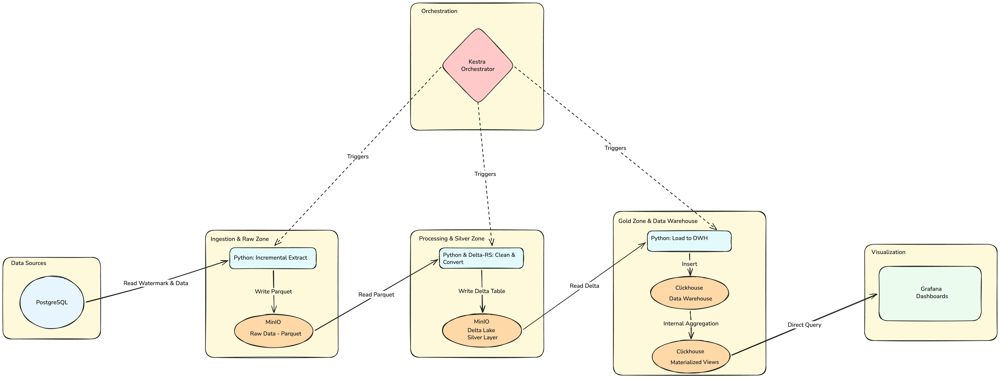

# Automated Data Pipeline for Manufacturing Analytics using Kestra, Delta Lake, ClickHouse, and Grafana

## Project Overview
Repositori ini berisi implementasi *end-to-end data pipeline* yang dirancang untuk kebutuhan analitik di sektor manufaktur . Fokus utama dari project ini adalah membangun arsitektur *batch processing* yang *scalable*, tangguh, dan efisien untuk memproses data operasional menjadi *insight* bisnis.

Pipeline ini mengatasi *bottleneck* umum pada sistem tradisional dengan mengimplementasikan *incremental loading*, *columnar storage*, dan meniadakan penggunaan *database* transaksional sebagai *layer* analitik.

## System Architecture & Workflow

Alur data dalam sistem ini berjalan melalui beberapa tahapan berikut:

1. **Data Source (PostgreSQL):** Mensimulasikan *database* operasional pabrik.
2. **Ingestion & Raw Storage (MinIO):** Skrip Python melakukan ekstraksi data secara *incremental* dari PostgreSQL dan menyimpannya ke dalam MinIO (S3-compatible storage) dalam format Parquet.
3. **Data Processing & Lakehouse (Delta Lake):** Data mentah dibaca, dibersihkan, dan dikonversi ke format Delta Table menggunakan `delta-rs` untuk memastikan integritas data (ACID compliance) sebelum disimpan kembali ke data lake.
4. **Data Warehouse (ClickHouse):** Data dari Delta Lake dimuat ke ClickHouse. Transformasi lanjutan dan pembuatan tabel agregasi untuk *data mart* dikelola langsung di dalam ClickHouse menggunakan *Materialized Views*.
5. **Data Visualization (Grafana):** Grafana terhubung langsung ke ClickHouse untuk memvisualisasikan data dan menyediakan *dashboard* analitik pabrik.
6. **Orchestration (Kestra):** Seluruh proses di atas (dari ekstraksi hingga *load* ke DWH) dijadwalkan dan dimonitor secara terpusat menggunakan Kestra.

## Key Engineering Decisions

Project ini dibangun dengan mengedepankan beberapa *best practices* dalam Data Engineering modern:

* **Incremental Loading:** Alih-alih melakukan *full overwrite* yang memakan banyak *resource*, pipeline ini menggunakan *watermark* (berdasarkan *timestamp*) untuk hanya mengekstrak data yang baru atau berubah.
* **Format Parquet & Delta Lake:** Mengganti penggunaan CSV konvensional dengan format berbasis kolom (Parquet) untuk efisiensi *storage* dan kecepatan *read*. Lapisan Delta Lake ditambahkan untuk memungkinkan *time-travel* dan penanganan skema data yang dinamis.
* **Eliminasi OLTP untuk Analytical Workload:** Menghindari *anti-pattern* dengan tidak memindahkan data analitik dari DWH (ClickHouse) kembali ke *database* baris (seperti MySQL) hanya untuk visualisasi. Grafana langsung melakukan *query* ke ClickHouse, memanfaatkan kecepatan *engine* OLAP secara maksimal.