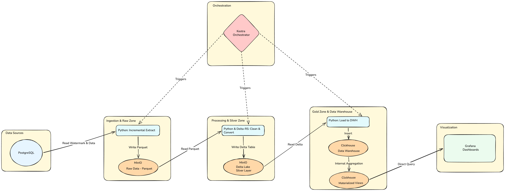
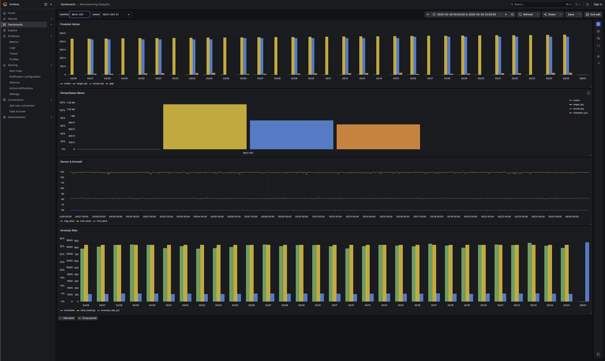
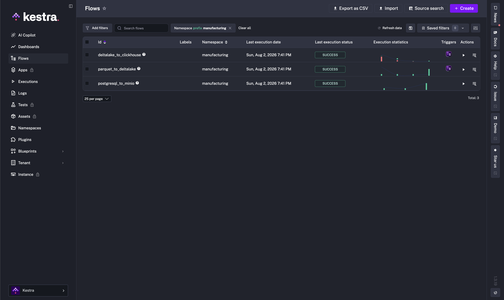

# Automated Data Pipeline for Manufacturing Analytics using Kestra, Delta Lake, ClickHouse, and Grafana

## Project Overview
Repositori ini berisi implementasi *end-to-end data pipeline* yang dirancang untuk kebutuhan analitik di sektor manufaktur . Fokus utama dari project ini adalah membangun arsitektur *batch processing* yang *scalable*, tangguh, dan efisien untuk memproses data operasional menjadi *insight* bisnis.

Pipeline ini mengatasi *bottleneck* umum pada sistem tradisional dengan mengimplementasikan *incremental loading*, *columnar storage*, dan meniadakan penggunaan *database* transaksional sebagai *layer* analitik.

## System Architecture & Workflow


Alur data dalam sistem ini berjalan melalui beberapa tahapan berikut:

1. **Data Source (PostgreSQL):** Mensimulasikan *database* operasional pabrik.
2. **Ingestion & Raw Storage (MinIO):** Skrip Python melakukan ekstraksi data secara *incremental* dari PostgreSQL dan menyimpannya ke dalam MinIO (S3-compatible storage) dalam format Parquet.
3. **Data Processing & Lakehouse (Delta Lake):** Data mentah dibaca, dibersihkan, dan dikonversi ke format Delta Table menggunakan `delta-rs` untuk memastikan integritas data (ACID compliance) sebelum disimpan kembali ke data lake.
4. **Data Warehouse (ClickHouse):** Data dari Delta Lake dimuat ke ClickHouse. Data dimuat *incrementally* dengan membaca versi baru dari Delta log (bukan *full snapshot*), sehingga tidak ada data ganda saat pipeline dijalankan ulang.
5. **Data Mart (Materialized Views):** Tabel agregasi untuk analitik dikelola langsung di ClickHouse melalui *materialized views* yang membaca data dari tabel utama. Panduan *dashboard* ada di [`docs/grafana-dashboard.md`](docs/grafana-dashboard.md).
6. **Data Visualization (Grafana):** Grafana terhubung langsung ke ClickHouse untuk memvisualisasikan data dan menyediakan *dashboard* analitik pabrik.
7. **Orchestration (Kestra):** Seluruh proses di atas (dari ekstraksi hingga *load* ke DWH) dijadwalkan dan dimonitor secara terpusat menggunakan Kestra. Ketiga flow (`extract` → `transform` → `load`) terhubung otomatis: saat flow *extract* sukses, flow *transform* dan *load* berjalan menyusul tanpa intervensi manual.

## Screenshots

**Dashboard Grafana** — 4 panel analitik pabrik (produksi harian, pemanfaatan mesin, sensor & anomaly, anomaly rate):



**Pipeline Execution (Kestra)** — monitor eksekusi flow `extract` → `transform` → `load`:



## Key Engineering Decisions

Project ini dibangun dengan mengedepankan beberapa *best practices* dalam Data Engineering modern:

* **Incremental Loading:** Alih-alih melakukan *full overwrite* yang memakan banyak *resource*, pipeline ini menggunakan *watermark* (berdasarkan *timestamp*) untuk hanya mengekstrak data yang baru atau berubah.
* **Versioning Delta Log untuk Load:** Tahap *load* tidak membaca ulang seluruh snapshot Delta setiap kali berjalan. Ia membandingkan versi Delta log terakhir yang dimuat (disimpan di *state* MinIO) dengan versi terbaru, lalu hanya memproses *file* yang ditambahkan pada versi baru. Hasilnya *idempoten*: menjalankan pipeline berulang kali tidak menghasilkan data ganda.
* **Format Parquet & Delta Lake:** Mengganti penggunaan CSV konvensional dengan format berbasis kolom (Parquet) untuk efisiensi *storage* dan kecepatan *read*. Lapisan Delta Lake ditambahkan untuk memungkinkan *time-travel* dan penanganan skema data yang dinamis.
* **Eliminasi OLTP untuk Analytical Workload:** Menghindari *anti-pattern* dengan tidak memindahkan data analitik dari DWH (ClickHouse) kembali ke *database* baris (seperti MySQL) hanya untuk visualisasi. Grafana langsung melakukan *query* ke ClickHouse, memanfaatkan kecepatan *engine* OLAP secara maksimal.

## Repository Structure

```text
├── infrastructure/
│   ├── docker-compose.yml      # Servis lokal: Postgres, MinIO, ClickHouse, Kestra, Grafana
│   └── clickhouse/             # DDL tabel utama (schema.sql) + materialized views (materialized_views.sql)
├── orchestration/              # Flow Kestra (extract, transform, load — saling terhubung via trigger)
├── src/
│   ├── Dockerfile              # Image tunggal manufacturing-etl:latest (dipakai ketiga flow)
│   ├── extract/                # postgres_to_minio.py — ingestion PostgreSQL ke MinIO
│   ├── transform/              # raw_to_deltalake.py — Parquet incremental ke Delta Lake
│   └── load/                   # delta_to_clickhouse.py — Delta Lake incremental ke ClickHouse
├── docs/                       # Diagram arsitektur + panduan dashboard Grafana (grafana-dashboard.md)
└── README.md